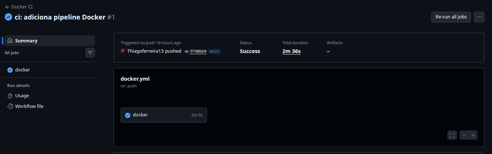
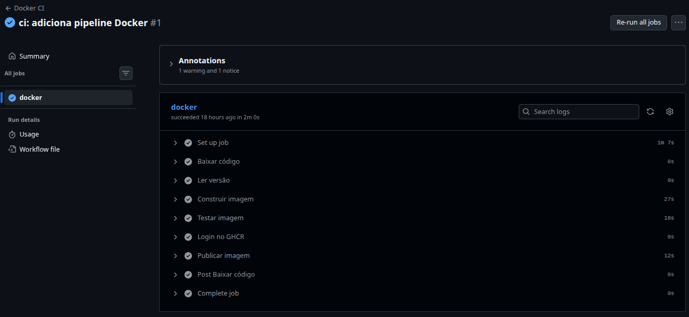
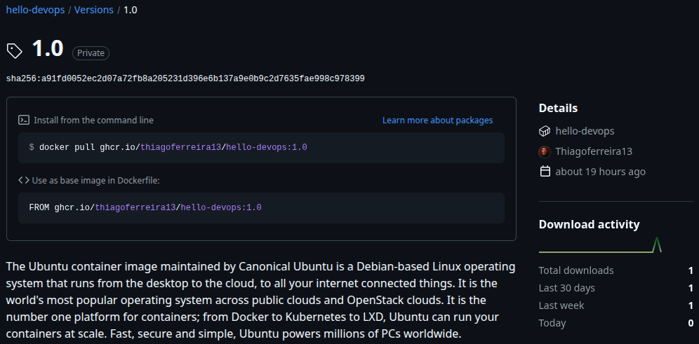
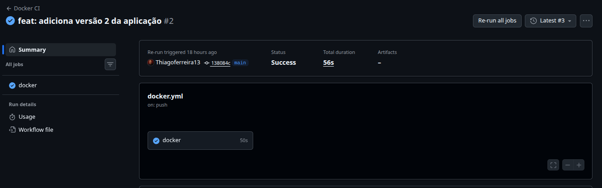
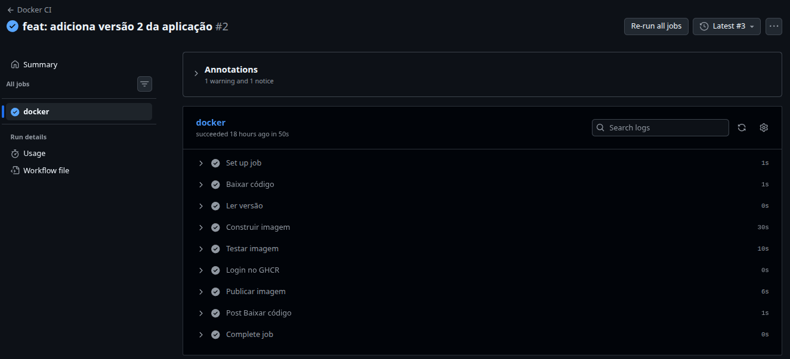
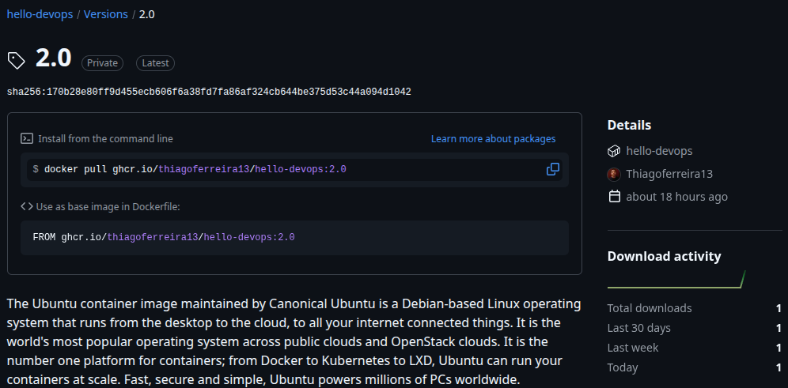
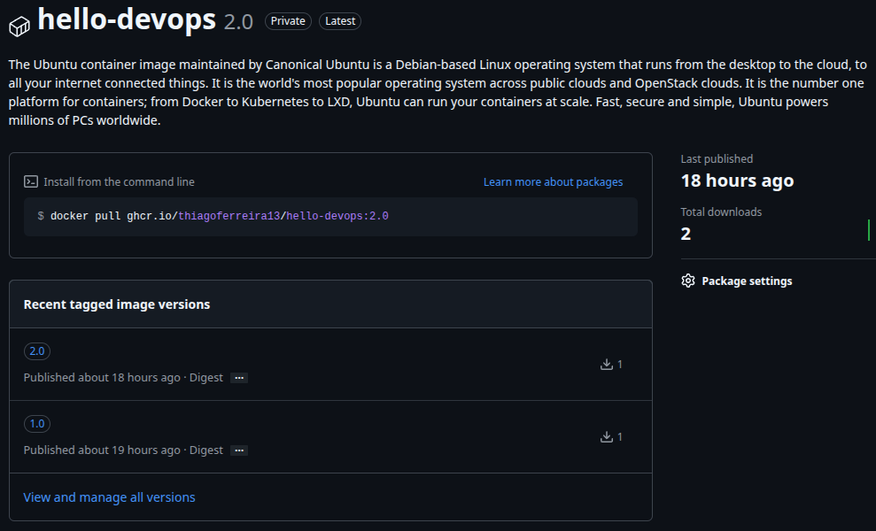

# Hello-devops
Atividade prática de DevOps com Spring Boot, Docker, GitHub Actions e publicação de imagens no GHCR.

## Endpoint

```text
GET /hello

```

# Evidências

## Versão 1.0 — Hello World

### Build local

A imagem da versão 1.0 foi construída localmente a partir do `Dockerfile`.

```console
$ docker build -t hello-devops-local:1.0 .
[+] Building 1.4s (14/14) FINISHED
...
=> [builder 5/5] RUN mvn clean package -DskipTests
=> [stage-1 3/3] COPY --from=builder /app/target/*.jar app.jar
=> naming to docker.io/library/hello-devops-local:1.0
```

Imagem criada:

```console
$ docker images
IMAGE                    ID             DISK USAGE   CONTENT SIZE
hello-devops-local:1.0   20afd9a495c9        523MB          138MB
```

### Execução local da versão 1.0

```console
$ docker run --rm -d --name hello-devops-local-v1 -p 8080:8080 hello-devops-local:1.0

d5121bd07c67cd09e6ce3adce197a5d4907f9b9b0947727d2577a958fcf50987
```

Container em execução:

```console
$ docker ps
CONTAINER ID   IMAGE                    COMMAND               STATUS         PORTS                                         NAMES
d5121bd07c67   hello-devops-local:1.0   "java -jar app.jar"   Up 6 seconds   0.0.0.0:8080->8080/tcp, [::]:8080->8080/tcp   hello-devops-local-v1
```

Teste do endpoint:

```console
$ curl http://localhost:8080/hello
Hello World
```

---

## Pipeline GitHub Actions — versão 1.0

O push para a branch principal disparou automaticamente o workflow do GitHub Actions, responsável pelo build, teste e publicação da imagem no GitHub Container Registry.






---

## Imagem 1.0 no GitHub Container Registry

Imagem publicada:

```text
ghcr.io/thiagoferreira13/hello-devops:1.0
```

Download da imagem publicada:

```console
$ docker pull ghcr.io/thiagoferreira13/hello-devops:1.0
1.0: Pulling from thiagoferreira13/hello-devops
Digest: sha256:a91fd0052ec2d07a72fb8a205231d396e6b137a9e0b9c2d7635fae998c978399
Status: Image is up to date for ghcr.io/thiagoferreira13/hello-devops:1.0
ghcr.io/thiagoferreira13/hello-devops:1.0
```

### Execução da imagem 1.0 baixada do Registry

```console
$ docker run --rm -d --name hello-devops-registry-v1 -p 8080:8080 ghcr.io/thiagoferreira13/hello-devops:1.0

18a631f19a319d6893e32bb8a2432df471642aff73f1a19c0fce25edd0b170ae
```

Container em execução:

```console
$ docker ps
CONTAINER ID   IMAGE                                       COMMAND               STATUS         PORTS                                         NAMES
18a631f19a31   ghcr.io/thiagoferreira13/hello-devops:1.0   "java -jar app.jar"   Up 4 seconds   0.0.0.0:8080->8080/tcp, [::]:8080->8080/tcp   hello-devops-registry-v1
```

Teste do endpoint:

```console
$ curl http://localhost:8080/hello
Hello World
```

---

# Versão 2.0 — Hello World 2

Após a alteração da aplicação, uma nova versão foi criada com a tag `2.0`.

### Build local

Imagem criada localmente:

```console
$ docker images
IMAGE                    ID             DISK USAGE   CONTENT SIZE
hello-devops-local:2.0   a3aa199b3f23        523MB          138MB
```

### Execução local da versão 2.0

```console
$ docker run --rm -d --name hello-devops-local-v2 -p 8080:8080 hello-devops-local:2.0

a50593cb26c84992f58d651bd29a02021ebfb36bfd53547664d776d122924e2f
```

Teste do endpoint:

```console
$ curl http://localhost:8080/hello
Hello World 2
```

---

## Pipeline GitHub Actions — versão 2.0

O novo push após a alteração da aplicação disparou novamente o workflow, construindo, testando e publicando a versão `2.0`.






---

## Imagem 2.0 no GitHub Container Registry

Imagem publicada:

```text
ghcr.io/thiagoferreira13/hello-devops:2.0
```

Download da imagem publicada:

```console
$ docker pull ghcr.io/thiagoferreira13/hello-devops:2.0
2.0: Pulling from thiagoferreira13/hello-devops
Digest: sha256:170b28e80ff9d455ecb606f6a38fd7fa86af324cb644be375d53c44a094d1042
Status: Image is up to date for ghcr.io/thiagoferreira13/hello-devops:2.0
ghcr.io/thiagoferreira13/hello-devops:2.0
```

### Execução da imagem 2.0 baixada do Registry

```console
$ docker run --rm -d --name hello-devops-registry-v2 -p 8080:8080 ghcr.io/thiagoferreira13/hello-devops:2.0

e3a0fa70502658fdd315a1622ac48bb78c1da136eac6a882faaf2a68079fe2b5
```

Container em execução:

```console
$ docker ps
CONTAINER ID   IMAGE                                       COMMAND               STATUS         PORTS                                         NAMES
e3a0fa705026   ghcr.io/thiagoferreira13/hello-devops:2.0   "java -jar app.jar"   Up 5 seconds   0.0.0.0:8080->8080/tcp, [::]:8080->8080/tcp   hello-devops-registry-v2
```

Teste do endpoint:

```console
$ curl http://localhost:8080/hello
Hello World 2
```

---

## Versões publicadas no GHCR

O GitHub Container Registry contém as duas versões exigidas pela atividade:

```text
ghcr.io/thiagoferreira13/hello-devops:1.0
ghcr.io/thiagoferreira13/hello-devops:2.0
```



---
